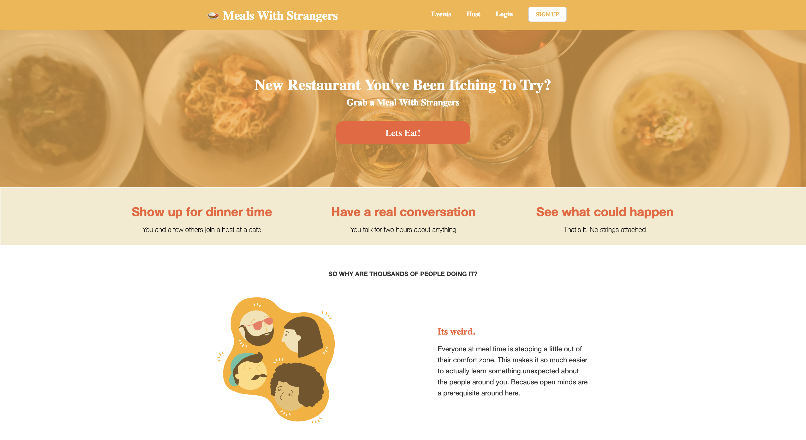
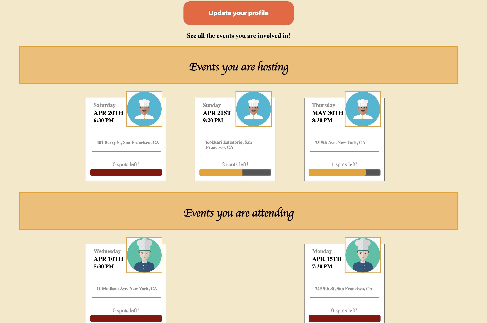
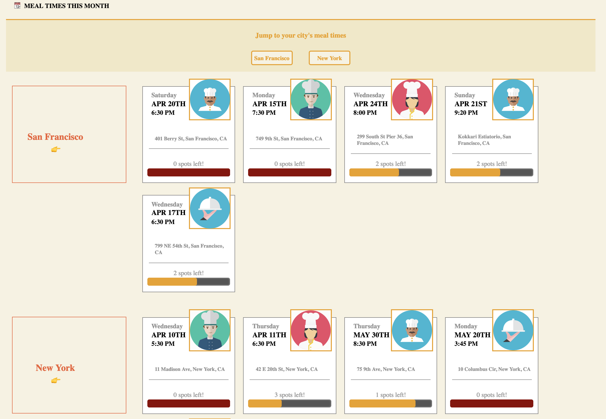
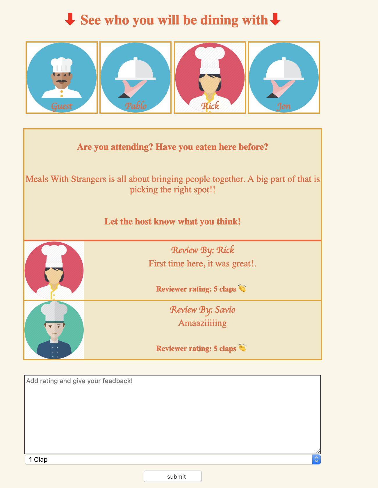

# MealsWithStrangers

## Table Of Contents
- ### [Background and Overview](#background-and-overview)
- ### [Features](#features)
- ### [Technologies](#technologies)
    - ##### [Demo](#demo)
- ### [Site](#site)
    - ##### [Splash](#splash)
    - ##### [Dashboard](#dashboard)
    - ##### [Event Index](#event-index)
    - ##### [Joins and Reviews](#joins-and-reviews)

### Background and Overview

Meals With Strangers is a platform that connects users with their neighbors (strangers) over food! It is inspired by [Tea With Strangers](http://www.teawithstrangers.com/)

### Features
- User Authorization from frontend to backend utilizing BCrypt password hashing
- Index page where users can see events, filtered by city
- Hosting page where user can create a new event
- Users can review events
- Users are able to join and leave events
- Dashboard displays hosted events, joined events, and provides access to update account information
### Technologies
Meals With Strangers was built on a `Ruby on Rails` backend with a `React/Redux` frontend. User data such as login, events, and reviews are stored in a `PostgreSQL` database.

### Demo
- [Live Demo](https://meals-with-strangers.herokuapp.com/#/)

### Site
- #### Splash
    
    

- #### Dashboard

    

- #### Event Index

    

- #### Joins and Reviews

    

[Back to the top](#table-of-contents)

